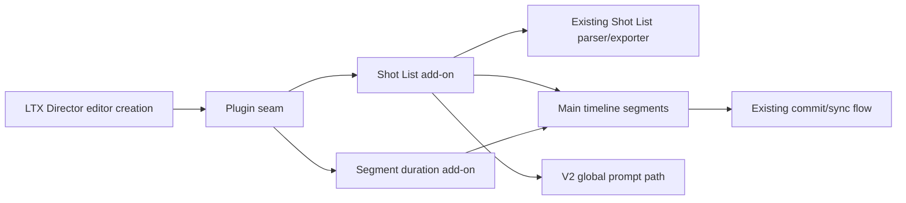

# feat: Add TWL LTX Director UI add-ons

## Summary

Add a minimal LTX Director plugin seam, then implement TWL-owned Shot List and segment duration UI add-ons behind that seam. The plan keeps upstream-owned editor changes small, verifies v2 global prompt behavior before wiring Shot List `GLOBAL:` import/export, and avoids reviving v1 prompt modals or broad v1 timeline actions.

---

## Problem Frame

The v2 LTX Director implementation is upstream-owned and likely to keep changing. TWL's v1 UX improvements were useful, but direct porting creates repeated conflict risk in the central editor files. This plan turns the selected UX into isolated add-ons while preserving the current v2 editor behavior described in the origin requirements.

---

## Requirements

- R1. The LTX Director UI must expose a small plugin seam that allows TWL-owned add-ons to run after the timeline editor is available.
- R2. TWL-specific UI behavior must live outside broad upstream-owned editor code wherever practical.
- R3. User-facing labels must use upstream-compatible terminology, especially `segment` for image, video, and text prompt timeline items.
- R4. Users must be able to open a Shot List UI from the LTX Director experience.
- R5. Users must be able to export the current main segment timeline as Shot List text.
- R6. Exported Shot List text must include enough information for users to understand segment order, segment duration, and segment prompts.
- R7. Users must be able to import Shot List text into the timeline.
- R8. Shot List import must support both replacing the current main segment timeline and appending imported shots after existing main segments.
- R9. Import must avoid silently destructive behavior; replacing existing main segments requires a clear user choice or confirmation.
- R10. Users must be able to directly edit the duration of a selected image, video, or text prompt segment.
- R11. Segment duration edits must ripple following main segments so sequence flow is preserved.
- R12. Duration editing must keep timeline state, visible timing, and generated segment data consistent after the change.
- R13. The first execution slice must not change global prompt behavior.
- R14. The first execution slice must not reintroduce v1 prompt modal behavior.
- R15. Deferred v1 UI/UX items must be recorded as backlog candidates, not silently pulled into this execution slice.

**Origin actors:** A1 LTX Director user, A2 fork maintainer, A3 future planning or implementation agent

**Origin flows:** F1 Shot List export, F2 Shot List import, F3 Segment duration edit, F4 Upstream-safe feature extension

**Origin acceptance examples:** AE1 Shot List export, AE2 replace import, AE3 append import, AE4 ripple duration edit, AE5 preserve upstream prompt behavior

---

## Scope Boundaries

- Do not port global prompt UI behavior from v1; use v2's current global prompt mechanism only after characterizing it.
- Do not reintroduce v1 prompt modals.
- Do not port old v1 example workflows in this plan.
- Do not broadly port unrelated v1 changes from audio, video, multi-image loader, patching, or prompt relay files.
- Keep retake-specific Shot List import and duration editing out of this slice unless implementation discovers the normal timeline controls already handle it safely.

### Deferred to Follow-Up Work

- Timeline trim actions, ripple delete gaps / close gaps, context-menu conveniences, and other v1 UX items: review against current v2 behavior before prioritizing.
- Retake-mode Shot List and duration behavior: revisit after the normal main timeline flow is stable.

---

## Context & Research

### Relevant Code and Patterns

- `__init__.py` exposes frontend assets through `WEB_DIRECTORY = "./js"`, so new browser add-ons can live under `js/`.
- `js/ltx_director.js` owns the main `TimelineEditor`, creates the toolbar and DOM widget, and instantiates the editor during node registration.
- `js/ltx_director.js` stores editor state in `this.timeline`, then `commitChanges()` serializes timeline state into hidden widgets such as `timeline_data`, `local_prompts`, `segment_lengths`, and `guide_strength`.
- `js/ltx_director.js` already has delicate global prompt synchronization with linked inputs, node properties, normal mode, and retake mode. Shot List `GLOBAL:` support must use this v2 path rather than restoring v1 behavior.
- `js/ltx_director_twl_shot_script.js` already provides Shot List parsing/exporting and exposes `globalThis.LTXDirectorShotList`.
- `tests/ltx_director_twl_shot_script.test.js` defines parser/export expectations and currently includes label assertions that should align with the add-on UI once implemented.

### Institutional Learnings

- `docs/twl-upstream-integration-strategy.md` establishes that `js/ltx_director.js`, `ltx_director.py`, and `README.md` are high-collision upstream surfaces.
- `docs/twl-upstream-integration-strategy.md` recommends a small `LTXDirectorPlugins` seam and TWL-owned `ltx_director_twl_*` frontend files.
- `docs/brainstorms/twl-ltx-director-addons-requirements.md` prioritizes Shot List first, segment duration second, and treats older v1 timeline actions as backlog candidates only.

### External References

- No external research was used. This work is repo-specific and has clear local patterns.

---

## Key Technical Decisions

- Plugin seam before features: Add the smallest stable hook after editor creation so future TWL add-ons avoid direct editor rewrites.
- UI-only by default: Keep `ltx_director.py` unchanged unless implementation proves a backend serialization change is necessary.
- Characterize v2 global prompt first: Shot List `GLOBAL:` should import/export through v2's current global prompt path, not through v1 behavior.
- Normal main timeline first: Apply Shot List import/export and duration editing to `timeline.segments`; preserve audio, motion, retake settings, and upstream global prompt semantics.
- Replace and append both supported: Replace requires an explicit destructive choice; append starts after the last main segment and preserves existing main segments.
- Ripple preserves spacing: Duration edits shift following main segments by the selected segment's duration delta rather than automatically closing pre-existing gaps.
- Pure helper tests where possible: Put mapping and ripple logic behind testable helpers so behavior can be covered without requiring a full ComfyUI browser harness.

---

## Open Questions

### Resolved During Planning

- Should Shot List `GLOBAL:` be ignored for import? No. It should be supported, but only by verifying and targeting v2's current global prompt mechanism.
- Should retake-specific behavior be included now? No. Plan the normal main timeline first and defer retake-specific behavior.
- Should ripple editing close all gaps? No. Preserve spacing by shifting following main segments by the delta.

### Deferred to Implementation

- Exact DOM placement for the Shot List button: choose the least intrusive location that feels native in the current toolbar/settings UI.
- Exact v2 global prompt write path: characterize current editor properties, inputs, widgets, and save behavior before wiring `GLOBAL:` import/export.
- Exact browser-level test harness for add-on UI: if the existing Node test style is insufficient for DOM behavior, keep UI verification manual and cover pure mapping/ripple helpers in automated tests.

---

## Output Structure

    js/
      ltx_director_twl_shot_list_ui.js
      ltx_director_twl_segment_duration_ui.js
    tests/
      ltx_director_twl_shot_list_ui.test.js
      ltx_director_twl_segment_duration_ui.test.js

---

## High-Level Technical Design

> *This illustrates the intended approach and is directional guidance for review, not implementation specification. The implementing agent should treat it as context, not code to reproduce.*

The seam should run add-ons after the editor exists and isolate plugin failures so one add-on cannot prevent the editor from loading. Add-ons should be idempotent per editor instance because node creation and workflow loading can re-enter initialization paths.

---

## Implementation Units

### U1. Add LTX Director plugin seam

**Goal:** Provide a minimal, upstream-safe hook that lets TWL-owned add-ons attach to a ready `TimelineEditor` instance.

**Requirements:** R1, R2, R13, R14; supports F4 and AE5

**Dependencies:** None

**Files:**
- Modify: `js/ltx_director.js`
- Test: `tests/ltx_director_twl_shot_script.test.js`

**Approach:**
- Add a global plugin registry and installer near the LTX Director registration code.
- Call the installer immediately after `TimelineEditor` creation succeeds.
- Make plugin execution failure-isolated and idempotency-friendly: a plugin failure should be logged without preventing the editor from loading.
- Do not change Python schema, backend execution, global prompt sync logic, or existing prompt UI.

**Patterns to follow:**
- `app.registerExtension` usage in `js/ltx_director.js` and other files under `js/`.
- Existing node creation and DOM widget initialization in `js/ltx_director.js`.

**Test scenarios:**
- Integration: Given the LTX Director UI source is loaded, the plugin registry and installer are present without removing existing node registration.
- Error path: Given a plugin throws during installation, the installer logs the failure and continues installing remaining plugins.
- Edge case: Given the same editor is initialized more than once, add-ons can guard themselves from duplicated controls.
- Covers AE5. Existing global prompt and prompt text-area behavior remain untouched by the seam.

**Verification:**
- Existing parser tests still run.
- The LTX Director node can be created in ComfyUI without console errors caused by the seam.
- No backend Python files are changed.

---

### U2. Characterize and expose Shot List timeline mapping helpers

**Goal:** Define testable behavior for converting between Shot List data and current v2 main timeline segments, including safe `GLOBAL:` handling.

**Requirements:** R3, R5, R6, R7, R8, R9, R13, R14; supports F1, F2, AE1, AE2, AE3, AE5

**Dependencies:** U1 for final integration; helper tests can be written before UI wiring.

**Files:**
- Create: `js/ltx_director_twl_shot_list_ui.js`
- Modify: `tests/ltx_director_twl_shot_script.test.js`
- Create: `tests/ltx_director_twl_shot_list_ui.test.js`

**Approach:**
- Reuse `globalThis.LTXDirectorShotList` rather than reimplementing parsing or formatting.
- Add pure helper behavior for exporting ordered main segments and importing parsed shots as text-like main segments.
- Characterize v2 global prompt storage before deciding the final read/write path for Shot List `GLOBAL:`.
- On export, include the current global prompt only when it can be read through v2's current safe path.
- On import, write `GLOBAL:` through v2's current global prompt path only after verification; do not bypass linked-input/property synchronization or retake-specific handling.
- Preserve audio, motion, retake state, settings, and non-main timeline state during Shot List import.

**Execution note:** Start with characterization or helper tests for export ordering, import mapping, and non-mutating invalid import behavior before wiring the visible UI.

**Patterns to follow:**
- Parser/export contract in `js/ltx_director_twl_shot_script.js`.
- Timeline mutation and serialization expectations in `js/ltx_director.js` `commitChanges()`.
- Existing v2 global prompt sync behavior in `js/ltx_director.js`.

**Test scenarios:**
- Covers AE1. Happy path: Given unordered main segments, exporting produces ordered shots with durations based on the current frame rate and prompts from each segment.
- Happy path: Given a current v2 global prompt and main segments, export includes safe global prompt context without altering editor state.
- Covers AE2. Happy path: Given existing main segments and valid Shot List text, replace creates imported main segments only after explicit replace selection.
- Covers AE3. Happy path: Given existing main segments ending at frame N, append starts imported shots after N and preserves existing main segments.
- Error path: Given invalid Shot List text, import reports parser errors and leaves timeline data unchanged.
- Edge case: Given parser warnings such as total-duration mismatch, import surfaces the warning and allows cancel/continue without mutating until the user continues.
- Covers AE5. Integration: Given Shot List text with `GLOBAL:`, import updates global prompt only through the verified v2 path and does not restore v1 modal/global-prompt behavior.

**Verification:**
- Automated helper tests cover export, replace, append, invalid input, warning behavior, and global prompt characterization assumptions.
- Existing parser tests remain aligned with the new add-on location for Shot List labels.

---

### U3. Add Shot List UI add-on

**Goal:** Give users a native-feeling Shot List entry point for view/export/import while keeping the feature code in TWL-owned UI code.

**Requirements:** R3, R4, R5, R6, R7, R8, R9, R13, R14; supports F1, F2, AE1, AE2, AE3, AE5

**Dependencies:** U1, U2

**Files:**
- Modify: `js/ltx_director_twl_shot_list_ui.js`
- Modify: `tests/ltx_director_twl_shot_script.test.js`
- Test: `tests/ltx_director_twl_shot_list_ui.test.js`

**Approach:**
- Register a Shot List add-on through the plugin seam.
- Add one visible entry point using current LTX Director styling and terminology.
- Provide export/view and import modes in a compact UI.
- For replace import, require an explicit user choice before changing existing main segments.
- For append import, add imported shots after the current main segment sequence.
- After mutation, call the existing editor synchronization path so widgets, serialized timeline state, canvas render, and generated segment data stay consistent.
- Keep retake-specific behavior out of the first slice; if the editor is in retake mode, make the first version clearly avoid mutating retake-specific state.

**Patterns to follow:**
- Existing `.pr-btn`, toolbar, settings menu, and modal-like styling in `js/ltx_director.js`.
- Existing editor methods such as `commitChanges()`, `syncWidgetsAndUI()`, `updateUIFromSelection()`, and `render()`.

**Test scenarios:**
- Covers AE1. Happy path: User opens Shot List UI, chooses export, and sees ordered Shot List text for current main segments.
- Covers AE2. Happy path: User chooses replace, confirms the destructive action, and the main timeline becomes the imported shots.
- Covers AE3. Happy path: User chooses append and imported shots appear after existing main segments.
- Error path: Invalid Shot List text displays parse feedback and does not mutate timeline state.
- Edge case: Empty or whitespace-only import input does not mutate timeline state.
- Integration: Audio, motion, retake settings, display mode, frame rate, and current v2 global prompt behavior survive replace and append operations.

**Verification:**
- The Shot List entry point appears once per LTX Director node.
- Export/import works in a live ComfyUI node without console errors.
- Workflow save/load still preserves the resulting timeline through existing serialized state.

---

### U4. Add segment duration ripple helpers

**Goal:** Define the timeline-state behavior for directly editing a main segment duration with ripple movement of following segments.

**Requirements:** R3, R10, R11, R12; supports F3 and AE4

**Dependencies:** U1 for final integration; helper tests can be written before UI wiring.

**Files:**
- Create: `js/ltx_director_twl_segment_duration_ui.js`
- Create: `tests/ltx_director_twl_segment_duration_ui.test.js`

**Approach:**
- Add pure helper behavior for computing a selected segment's new duration and shifting following main segments by the duration delta.
- Use current frame rate when accepting seconds; keep internal timeline storage in frames.
- Preserve spacing between later segments instead of closing all pre-existing gaps.
- Grow the timeline when the final segment extends past the current duration using the editor's existing growth/sync behavior.
- Avoid changing audio, motion, retake state, or global prompt state.

**Execution note:** Implement helper tests first because ripple behavior is easy to regress and can be verified without a browser harness.

**Patterns to follow:**
- Existing internal segment model in `timeline.segments`.
- Existing duration/frame-rate helpers and timeline growth behavior in `js/ltx_director.js`.

**Test scenarios:**
- Covers AE4. Happy path: Increasing a selected segment duration shifts later main segments later by the delta.
- Happy path: Decreasing a selected segment duration shifts later main segments earlier by the delta without making any start negative.
- Edge case: Editing the last segment changes only that segment and grows the timeline if needed.
- Edge case: Pre-existing gaps between later segments remain gaps after ripple; they are shifted, not closed.
- Edge case: Text and image segments can be resized according to minimum duration rules.
- Edge case: Video segments respect current v2 media duration constraints when those constraints are available through the editor state.
- Integration: After helper application, the state is ready for existing commit/sync/render flow.

**Verification:**
- Helper tests prove delta, ordering, spacing preservation, min-duration behavior, and timeline growth expectations.

---

### U5. Add segment duration UI add-on

**Goal:** Let users edit the selected main segment's duration directly from the current v2 editor experience.

**Requirements:** R3, R10, R11, R12, R13, R14; supports F3, AE4, AE5

**Dependencies:** U1, U4

**Files:**
- Modify: `js/ltx_director_twl_segment_duration_ui.js`
- Test: `tests/ltx_director_twl_segment_duration_ui.test.js`

**Approach:**
- Register a segment duration add-on through the plugin seam.
- Add a compact duration control for the selected normal main segment, using `segment` terminology.
- Keep the control disabled or empty when no eligible main segment is selected.
- Apply duration changes through the ripple helper, then call the existing editor sync/render path.
- Respect current display/frame-rate behavior so users can work in the mode the editor already presents.
- Do not add prompt modals or alter the global prompt UI.

**Patterns to follow:**
- Existing selection, bounds display, and prompt field update patterns in `js/ltx_director.js`.
- Existing editor methods for selection updates and commit/render synchronization.

**Test scenarios:**
- Covers AE4. Happy path: Selecting a main segment populates the duration control; changing it ripples later main segments and updates serialized segment data.
- Edge case: Selecting audio, motion, retake-only content, or no segment disables the control.
- Error path: Invalid duration input leaves the timeline unchanged and restores or reports the current valid duration.
- Integration: Existing global prompt and resizable prompt text areas are unchanged after using the duration control.

**Verification:**
- Live ComfyUI node shows one duration control per editor instance.
- Segment duration edits update visible segment bounds, timeline rendering, and generated widget data consistently.

---

### U6. Update docs and backlog notes

**Goal:** Document the shipped TWL add-ons and preserve deferred v1 UX candidates without turning them into active scope.

**Requirements:** R15; supports A2, A3

**Dependencies:** U3, U5

**Files:**
- Modify: `README.md`
- Modify: `docs/twl-upstream-integration-strategy.md`
- Modify: `docs/brainstorms/twl-ltx-director-addons-requirements.md` if implementation changes scope assumptions

**Approach:**
- Update user-facing docs only after behavior exists.
- Describe Shot List and segment duration behavior at a user level.
- Keep deferred v1 timeline actions recorded as backlog candidates, not committed feature promises.
- Note that TWL-owned add-ons are intentionally isolated for upstream compatibility.

**Patterns to follow:**
- Existing concise README bullet style.
- Existing strategy doc sections for feature priorities and deferred items.

**Test scenarios:**
- Test expectation: none -- documentation-only unit.

**Verification:**
- Docs match implemented behavior and do not claim deferred backlog candidates are shipped.

---

## System-Wide Impact

- **Interaction graph:** New add-ons run through the plugin seam after editor creation and mutate only the editor instance they receive.
- **Error propagation:** Plugin failures should be logged and isolated; invalid Shot List input or invalid duration input should not mutate timeline state.
- **State lifecycle risks:** Main risks are duplicate controls after workflow load, partial timeline mutation before validation, and global prompt writes that bypass v2 sync behavior.
- **API surface parity:** No Python node schema or backend execution change is planned.
- **Integration coverage:** Live ComfyUI verification is needed because add-ons interact with DOM state, hidden widgets, and canvas rendering.
- **Unchanged invariants:** Global prompt behavior, prompt text-area behavior, audio/motion/retake state, and existing timeline serialization remain owned by upstream v2 behavior.

---

## Risks & Dependencies

| Risk | Mitigation |
|------|------------|
| Plugin seam becomes another upstream conflict point | Keep it minimal and close to editor creation, with feature logic in TWL-owned files. |
| Shot List `GLOBAL:` import writes the wrong state | Characterize v2 global prompt behavior before wiring import/export; use the native v2 path only. |
| Add-ons duplicate controls on workflow load or node recreation | Make plugin installation idempotent per editor instance. |
| Import mutates timeline before validation finishes | Parse and validate first; only commit after import mode and warnings are resolved. |
| Ripple duration edits corrupt timeline ordering | Cover delta behavior with helper tests and use existing commit/render synchronization. |
| Existing parser test expectations are ahead of UI implementation | Update tests as add-on UI lands so they assert the new TWL-owned UI surface rather than old v1 assumptions. |

---

## Documentation / Operational Notes

- Update `README.md` after the UI behavior is implemented and verified.
- Keep `docs/twl-upstream-integration-strategy.md` current if implementation changes the seam contract or add-on file structure.
- Manual verification should include node creation, workflow load, timeline save/load, Shot List export/import, duration edit, and prompt/global prompt non-regression.

---

## Sources & References

- **Origin document:** [docs/brainstorms/twl-ltx-director-addons-requirements.md](../brainstorms/twl-ltx-director-addons-requirements.md)
- Integration strategy: [docs/twl-upstream-integration-strategy.md](../twl-upstream-integration-strategy.md)
- Main editor: `js/ltx_director.js`
- Shot List parser: `js/ltx_director_twl_shot_script.js`
- Shot List parser tests: `tests/ltx_director_twl_shot_script.test.js`
- Backend node, expected unchanged: `ltx_director.py`
