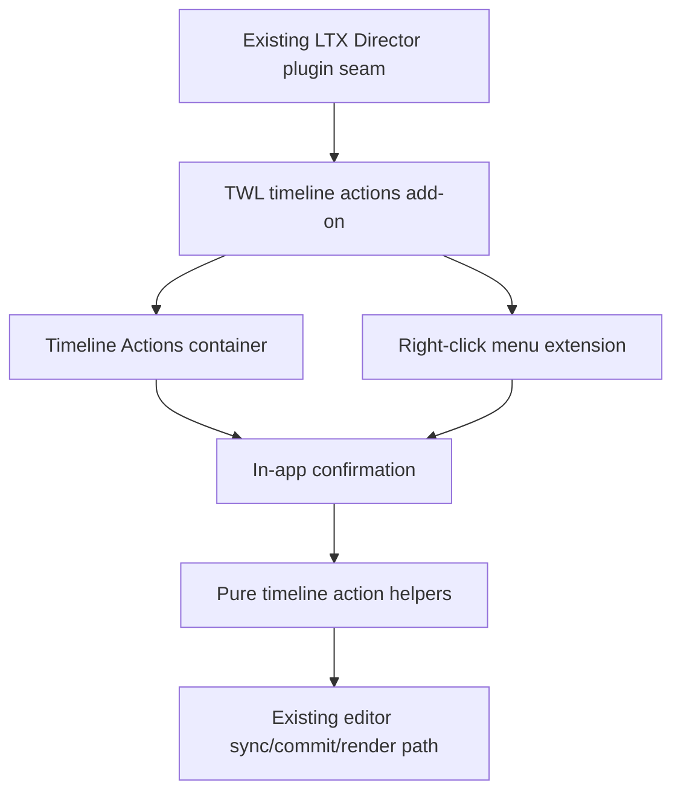
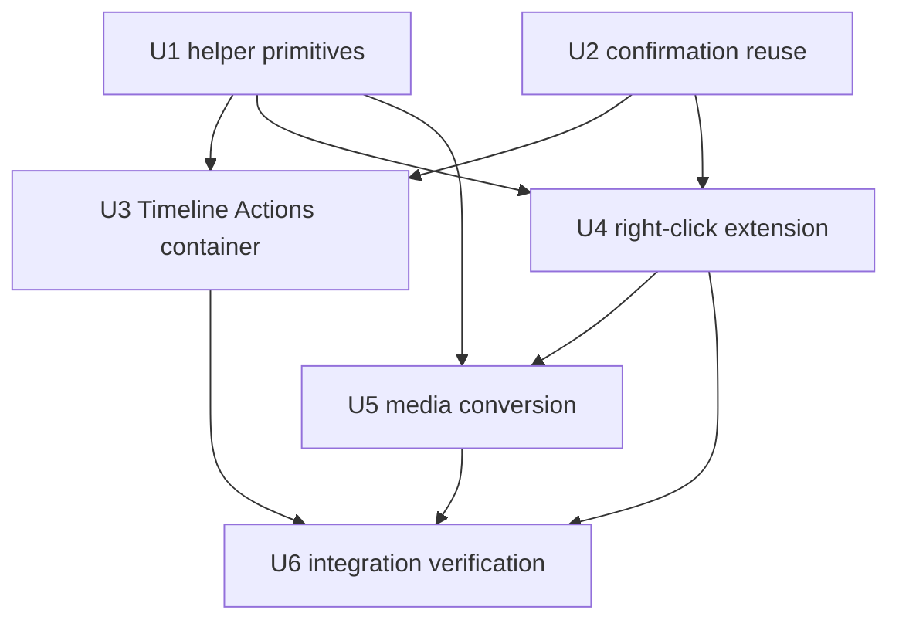

# feat: Add TWL LTX Director timeline actions

## Summary

Add the next TWL LTX Director add-on slice as a focused timeline-actions plugin. The plan keeps the completed Shot List and segment-duration work intact, adds timeline-wide and right-click actions through TWL-owned frontend code, and only allows a tiny upstream editor seam if plugin wrapping cannot safely extend the current right-click menu.

---

## Problem Frame

The v2 LTX Director editor already has useful upstream timeline behavior and a completed TWL plugin seam. The remaining v1 timeline action wins need to come forward without replacing upstream Delete, reviving broad v1 UI behavior, or turning future upstream syncs into large merge conflicts.

---

## Requirements

- R1. The LTX Director UI must expose a small plugin seam that allows TWL-owned add-ons to run after the timeline editor is available.
- R2. TWL-specific UI behavior must live outside broad upstream-owned editor code wherever practical.
- R3. User-facing labels must use upstream-compatible terminology, especially `segment` for image, video, and text prompt timeline items.
- R17. The first execution slice must not change global prompt behavior.
- R18. The first execution slice must not reintroduce v1 prompt modal behavior.
- R19. Deferred v1 UI/UX items must be recorded as backlog candidates, not silently pulled into this execution slice.
- R20. Users must have access to a TWL-owned Timeline Actions area injected near the timeline experience for timeline-wide actions.
- R21. The Timeline Actions area must include Ripple Delete for removing the current selection with sequence-preserving ripple behavior.
- R22. The Timeline Actions area must include Ripple Delete Gaps for closing timeline gaps without requiring manual segment dragging.
- R23. The Timeline Actions area must include Trim to Last Clip so the timeline can be shortened to the end of the last clip or segment.
- R24. The Timeline Actions area must include Reset Timeline for clearing timeline-specific content and action state without clearing the full node experience.
- R25. The Timeline Actions area must include Reset All for broader full-node reset behavior.
- R26. Destructive timeline-wide actions, especially Reset Timeline and Reset All, must require clear in-app confirmation before applying.
- R27. The existing upstream Delete action must remain in its current place and continue to behave as the upstream author intended.
- R28. Segment right-click menus must include Ripple Delete as a separate action from the upstream Delete action.
- R29. Segment right-click menus must include Add Segment Before and Add Segment After using the upstream author's `segment` terminology instead of v1's `shot` terminology.
- R30. Add Segment Before and Add Segment After must ripple later main segments to make room so the sequence remains ordered.
- R31. Segment right-click menus must include Convert to Text, Convert to Image, and Convert to Video where those actions are valid for the selected segment.
- R32. Convert to Text must preserve the segment prompt and related audio and IC-LoRA video track content, while removing the selected segment's main visual media.
- R33. Convert to Image must preserve the segment prompt and allow the user to choose replacement image media through the file picker.
- R34. Convert to Video must preserve the segment prompt and allow the user to choose replacement video media through the file picker.
- R35. Convert to Text must require confirmation because it removes visual media from the segment.

**Origin actors:** A1 LTX Director user, A2 fork maintainer, A3 future planning or implementation agent

**Origin flows:** F4 Upstream-safe feature extension, F5 Timeline-wide action, F6 Right-click segment action

**Origin acceptance examples:** AE8 timeline cleanup actions, AE9 reset confirmations, AE10 upstream Delete plus Ripple Delete, AE11 Add Segment Before/After, AE12 Convert to Text, AE13 Convert to Image/Video

---

## Scope Boundaries

- Do not replace, move, or redefine upstream's existing Delete action.
- Do not change global prompt UI or behavior.
- Do not reintroduce v1 prompt modal behavior.
- Do not port old v1 example workflows.
- Do not broadly port unrelated v1 changes from audio, video, multi-image loader, patching, or prompt relay files.
- Do not add unnamed v1 timeline actions beyond the confirmed Ripple Delete, Ripple Delete Gaps, Trim to Last Clip, Reset Timeline, Reset All, Add Segment Before/After, and Convert to Text/Image/Video.
- Keep right-click TWL actions main-segment-focused unless implementation discovers an existing safe track-local pattern that can be reused without expanding product scope.

### Deferred to Follow-Up Work

- Retake-mode-specific timeline action behavior: keep normal timeline behavior first unless the current editor path already handles retake mode safely.
- Broader context-menu redesign: this plan may add a minimal extension seam, but does not redesign the upstream context menu.
- Additional media conversion variants beyond image, video, and text.

---

## Context & Research

### Relevant Code and Patterns

- `__init__.py` exposes frontend assets through `WEB_DIRECTORY = "./js"`, so new browser add-ons can live under `js/`.
- `docs/twl-upstream-integration-strategy.md` marks `js/ltx_director.js`, `ltx_director.py`, and `README.md` as high-collision upstream surfaces and recommends TWL-owned `ltx_director_twl_*` files.
- `js/ltx_director.js` already contains the plugin registry and calls plugin installation after `TimelineEditor` creation.
- `js/ltx_director_twl_shot_list_ui.js` and `js/ltx_director_twl_segment_duration_ui.js` show the current add-on pattern: exported pure helpers for tests, browser registration through `registerLTXDirectorPlugin`, idempotent install guards, and existing editor sync methods after mutation.
- `tests/ltx_director_twl_segment_duration_ui.test.js` demonstrates pure helper coverage for ripple-style timeline mutation without a full browser harness.
- `tests/ltx_director_twl_shot_list_ui.test.js` demonstrates confirmation/cancel/stale-guard tests for destructive timeline mutation.
- `js/ltx_director.js` owns the current upstream context menu, upstream Delete behavior, file upload helpers, gap menu behavior, and linked video/audio segment conventions.
- The `ltx-director-v1-twlai` branch is useful for behavioral reference for Ripple Delete, Ripple Delete Gaps, Trim to Last Clip, Reset Timeline, Reset All, and Add Shot Before/After, but user-facing labels must be updated to v2 `segment` terminology.

### Institutional Learnings

- `docs/solutions/ui-bugs/ltx-director-shot-list-modal-metadata-round-trip-2026-06-21.md`: destructive timeline mutations should be deliberate, confirmation-backed, cancel-safe, and centralized so stale UI state does not mutate the timeline unexpectedly.
- `docs/solutions/conventions/twl-parser-file-naming-convention-2026-06-20.md`: TWL-owned files should include `twl` in the filename so ownership stays obvious during future upstream diffs and merges.

### External References

- No external research was used. This is repo-specific and the current v2 code plus the v1 branch provide the relevant implementation guidance.

---

## Key Technical Decisions

- New focused add-on file: Implement this slice in a TWL-owned timeline-actions add-on instead of reopening the completed Shot List or duration files.
- Plugin-first menu extension: Prefer an idempotent plugin wrapper around the existing segment context menu; if that proves too brittle, add the smallest possible menu-extension seam in the upstream editor file.
- Preserve upstream Delete exactly: TWL Ripple Delete is additive and must not call for changes to the existing Delete button or context-menu Delete behavior.
- Main-sequence ripple default: Ripple actions operate on the main timeline sequence and directly linked video/audio siblings; independent audio and IC-LoRA motion track timing is preserved unless selected behavior explicitly includes it.
- Reset distinction: Reset Timeline clears timeline content and selection state while preserving broader node settings; Reset All restores LTX Director UI/timeline state to defaults without deleting uploaded files from disk.
- Conversion timing: Convert to Image and Convert to Video preserve the selected segment's prompt, start, and length; Convert to Video records available media duration but does not resize the segment to natural video length.
- Confirmation pattern: Destructive actions use the TWL in-app confirmation style, not browser `confirm()`.
- Testable helpers first: Put timeline mutation and conversion decision logic behind exported pure helpers so Node tests can cover behavior without relying on a full ComfyUI browser harness.

---

## Open Questions

### Resolved During Planning

- Should this reopen the completed add-ons plan? No. Create a new focused follow-up plan for timeline actions.
- Should right-click TWL actions replace upstream Delete? No. Upstream Delete remains unchanged and TWL Ripple Delete is separate.
- Should Add Segment Before/After use v1 `shot` terminology? No. Use `segment` terminology.
- Should Add Segment Before/After use existing gaps only? No. Add adjacent text segments and ripple later main segments to make room.
- Should Convert to Video resize to the selected file's natural duration? No. Preserve the selected segment's current timing.
- Should Reset All delete uploaded files from disk? No. It resets node/timeline state only.

### Deferred to Implementation

- Exact DOM placement for the Timeline Actions container: choose the least intrusive location after inspecting the current rendered toolbar/timeline layout, with preference for a grouped container near existing timeline controls rather than crowding upstream upload/Delete buttons.
- Exact context-menu extension mechanism: start plugin-first; add a tiny upstream seam only if wrapping the current menu is brittle or unsafe.
- Exact media-field cleanup list for Convert to Text/Image/Video: finalize against the current v2 segment objects while preserving prompt, timing, audio, and IC-LoRA motion requirements.
- Exact video upload reuse path for Convert to Video: reuse current upload helpers where possible, but avoid a path that creates a new blank-prompt segment instead of converting in place.
- Exact retake-mode affordance: disable or hide normal timeline actions in retake mode unless implementation verifies a specific action is safe.

---

## Output Structure

    js/
      ltx_director_twl_timeline_actions_ui.js
    tests/
      ltx_director_twl_timeline_actions_ui.test.js

---

## High-Level Technical Design

> *This illustrates the intended approach and is directional guidance for review, not implementation specification. The implementing agent should treat it as context, not code to reproduce.*

The add-on should install once per editor instance, expose helper functions for tests, and treat UI actions as thin wrappers over centralized mutation helpers. Context-menu behavior should preserve the upstream menu first, then append TWL actions in a separate group so the original Delete remains visually and behaviorally intact.

---

## Implementation Units

### U1. Add timeline action helper primitives

**Goal:** Define testable timeline mutation behavior for ripple delete, gap closing, trim to last clip, reset timeline, reset all, and adjacent text segment insertion.

**Requirements:** R3, R20, R21, R22, R23, R24, R25, R27, R29, R30; supports F5, F6, AE8, AE9, AE10, AE11

**Dependencies:** None

**Files:**
- Create: `js/ltx_director_twl_timeline_actions_ui.js`
- Test: `tests/ltx_director_twl_timeline_actions_ui.test.js`

**Approach:**
- Create exported helper functions that accept lightweight editor-like objects and mutate timeline state only through explicit action entry points.
- Model Ripple Delete separately from upstream Delete: remove the selected main segment or selected main-segment ranges, collapse later main segments by deleted occupied duration, and handle directly linked video/audio siblings as part of the selected media group.
- Model Ripple Delete Gaps as main-track gap compaction to frame 0; preserve independent audio and IC-LoRA motion timing unless later implementation deliberately extends the helper with an explicit option.
- Model Trim to Last Clip as setting the timeline end to the last relevant clip end across visible segment tracks, with empty timelines treated as no-op.
- Model Reset Timeline as clearing main, audio, and motion segment arrays plus selection/mark/playhead action state while preserving global prompt and node settings.
- Model Reset All as restoring LTX Director timeline/UI state to current constructor defaults without deleting uploaded files from disk.
- Model Add Segment Before/After as inserting a one-second text segment adjacent to the selected main segment and shifting later main segments by the inserted duration.
- Centralize post-mutation sync in one helper that calls the existing editor update, widget sync, commit, render, and timeline-growth hooks when present.

**Execution note:** Implement helper tests before wiring visible UI so the risky timeline mutations are characterized without a browser harness.

**Patterns to follow:**
- Ripple helper style in `js/ltx_director_twl_segment_duration_ui.js`.
- Editor mock style in `tests/ltx_director_twl_segment_duration_ui.test.js`.
- Confirmation/cancel preservation tests in `tests/ltx_director_twl_shot_list_ui.test.js`.
- v1 behavior in `ltx-director-v1-twlai` as reference, translated to v2 segment terminology and motion/video-track semantics.

**Test scenarios:**
- Covers AE10. Happy path: Given a selected main segment followed by later main segments, Ripple Delete removes the selected segment and shifts later main segments earlier while upstream Delete behavior remains unmodified by tests that call the original delete stub separately.
- Happy path: Given a selected linked video segment, Ripple Delete removes the directly linked audio sibling without shifting independent audio or motion segments.
- Edge case: Given no selection, an invalid selected index, or a ghost/temp pseudo-segment, Ripple Delete returns a no-op result and does not call commit/render.
- Covers AE8. Happy path: Given main segments with gaps before and between them, Ripple Delete Gaps compacts them contiguously from frame 0.
- Edge case: Given overlapping main segments, gap compaction does not invent overlap resolution beyond the helper's documented behavior.
- Covers AE8. Happy path: Given main, audio, and motion segments, Trim to Last Clip updates the timeline end to the latest relevant segment end.
- Edge case: Given an empty timeline, Trim to Last Clip is a no-op and preserves the current duration.
- Covers AE9. Happy path: Reset Timeline clears segment arrays and selection state while preserving global prompt and node-level settings.
- Covers AE9. Happy path: Reset All restores default timeline/prompt/action state while avoiding any uploaded-file deletion behavior.
- Covers AE11. Happy path: Add Segment Before inserts a one-second text segment at the selected segment start and shifts the selected and later main segments later.
- Covers AE11. Happy path: Add Segment After inserts a one-second text segment at the selected segment end and shifts later main segments later.
- Integration: Each mutating helper calls the shared editor sync path once after successful mutation.

**Verification:**
- Helper tests prove the mutation semantics before DOM integration.
- Existing Shot List and segment duration tests still pass unchanged.

---

### U2. Reuse or extract TWL confirmation behavior

**Goal:** Provide the timeline-actions add-on with the existing TWL in-app confirmation behavior without coupling the new slice to Shot List internals.

**Requirements:** R13, R26, R35; supports AE9, AE12

**Dependencies:** None

**Files:**
- Modify: `js/ltx_director_twl_shot_list_ui.js`
- Modify: `js/ltx_director_twl_timeline_actions_ui.js`
- Test: `tests/ltx_director_twl_shot_list_ui.test.js`
- Test: `tests/ltx_director_twl_timeline_actions_ui.test.js`

**Approach:**
- Reuse the existing in-app confirmation style and accessibility behavior from the Shot List add-on.
- Prefer a small shared browser-facing TWL confirmation API or local extraction over copying a second divergent modal implementation.
- Preserve the current browser global boundary that avoids exposing broad modal internals; expose only the minimal callable confirmation behavior needed by add-ons.
- Build action-specific confirmation descriptors for Reset Timeline, Reset All, and Convert to Text.
- Ensure cancel and stale-action guards are first-class behavior, not incidental UI outcomes.

**Execution note:** Add cancel/no-op tests before connecting destructive buttons.

**Patterns to follow:**
- `openConfirmModal`, `buildApplyConfirmation`, and `applyShotListTextWithConfirmation` behavior in `js/ltx_director_twl_shot_list_ui.js`.
- `docs/solutions/ui-bugs/ltx-director-shot-list-modal-metadata-round-trip-2026-06-21.md` guidance on deliberate, centralized timeline mutations.

**Test scenarios:**
- Happy path: Given a destructive timeline action and a confirming response, the action proceeds and returns an applied result.
- Error path: Given a destructive timeline action and a cancel response, timeline state is unchanged and sync hooks are not called.
- Edge case: Given a stale action guard that fails after confirmation, the action does not mutate timeline state.
- Integration: Existing Shot List confirmation tests continue to pass after any shared confirmation extraction.
- Accessibility: The confirmation path remains keyboard-dismissable and focus-restoring at the same level as the Shot List modal.

**Verification:**
- Timeline actions can use an in-app confirmation without browser `confirm()`.
- Shot List confirmation behavior does not regress.

---

### U3. Add Timeline Actions container

**Goal:** Add a visible TWL-owned Timeline Actions area for timeline-wide commands without crowding or moving upstream controls.

**Requirements:** R1, R2, R3, R20, R21, R22, R23, R24, R25, R26, R27; supports F4, F5, AE8, AE9, AE10

**Dependencies:** U1, U2

**Files:**
- Modify: `js/ltx_director_twl_timeline_actions_ui.js`
- Test: `tests/ltx_director_twl_timeline_actions_ui.test.js`

**Approach:**
- Register the add-on through `registerLTXDirectorPlugin` with the same fallback pattern as existing TWL add-ons.
- Install idempotently per editor instance so workflow load or plugin re-registration cannot duplicate the container.
- Create a compact group labeled `Timeline Actions` with buttons for Ripple Delete, Ripple Delete Gaps, Trim to Last Clip, Reset Timeline, and Reset All.
- Place the group near the timeline experience using current editor DOM anchors, with the final DOM placement chosen during implementation based on the rendered v2 layout.
- Keep upstream Delete where it is; do not add a duplicate normal Delete to the TWL container.
- Disable or no-op actions when no valid selection/timeline state exists; prefer disabled affordances for selection-dependent actions when straightforward.
- Route Reset Timeline and Reset All through confirmation before mutation.

**Patterns to follow:**
- Button injection in `js/ltx_director_twl_shot_list_ui.js`.
- Existing `.pr-btn`, `.pr-controls-group`, and related LTX Director styles in `js/ltx_director.js`.
- Idempotent install guard in `js/ltx_director_twl_segment_duration_ui.js`.

**Test scenarios:**
- Happy path: Given an editor with a toolbar/timeline wrapper, the add-on installs one Timeline Actions group with the expected action labels.
- Edge case: Given the plugin installs twice on the same editor, only one Timeline Actions group exists.
- Covers AE8. Happy path: Clicking Ripple Delete Gaps or Trim to Last Clip invokes the corresponding helper and syncs the editor.
- Covers AE9. Happy path: Clicking Reset Timeline or Reset All asks for confirmation before invoking the helper.
- Error path: Canceling Reset Timeline or Reset All leaves timeline state unchanged.
- Covers AE10. Integration: Installing the Timeline Actions group does not remove or relabel upstream Delete.
- Edge case: In retake mode or unsupported timeline state, normal timeline actions are disabled or safely no-op.

**Verification:**
- The Timeline Actions area appears once and uses `segment`-compatible terminology where applicable.
- Current upstream upload buttons and Delete remain present.
- Existing add-on tests still pass.

---

### U4. Extend right-click segment actions

**Goal:** Add TWL segment-local actions to the right-click menu while preserving the upstream menu and Delete behavior.

**Requirements:** R1, R2, R3, R27, R28, R29, R30, R31; supports F4, F6, AE10, AE11

**Dependencies:** U1, U2

**Files:**
- Modify: `js/ltx_director_twl_timeline_actions_ui.js`
- Modify only if needed: `js/ltx_director.js`
- Test: `tests/ltx_director_twl_timeline_actions_ui.test.js`

**Approach:**
- Start with an idempotent plugin wrapper around the editor's current segment context-menu method: call the original menu builder, then append TWL actions to the rendered menu in a separate group.
- If wrapper-based extension is brittle, add a tiny upstream-safe context-menu extension seam that lets plugins append segment menu items after the upstream menu is built.
- Add right-click actions only for valid main timeline segments: Ripple Delete, Add Segment Before, Add Segment After, Convert to Text, Convert to Image, and Convert to Video where applicable.
- Keep upstream Delete visually present and unchanged; place TWL Ripple Delete separately so the user can distinguish normal delete from sequence-preserving delete.
- Route Add Segment Before/After through the U1 adjacent insertion helper.
- Route Ripple Delete through the U1 ripple delete helper.
- Keep text/image/video conversion menu entries wired to U5 conversion helpers.

**Patterns to follow:**
- Existing `showContextMenu` action grouping in `js/ltx_director.js`.
- Existing right-click labels such as `Copy Segment`, `Paste Segment`, `Replace Segment`, and `Delete` in `js/ltx_director.js`.
- Current plugin seam and TWL add-on registration pattern.

**Test scenarios:**
- Covers AE10. Happy path: Given a mocked upstream menu containing Delete, the TWL extension appends Ripple Delete without removing or changing Delete.
- Edge case: Installing the right-click extension twice wraps once and does not duplicate menu items.
- Covers AE11. Happy path: Add Segment Before and Add Segment After use `segment` labels and call adjacent insertion helpers.
- Edge case: Right-clicking audio or motion segments does not show unsupported main-segment conversion actions.
- Error path: If the upstream menu cannot be found after the original method runs, the wrapper fails safely and logs without breaking the original context menu.
- Integration: Existing copy/paste/split/delete menu callbacks remain reachable after extension.

**Verification:**
- Right-click menu has the new TWL action group and preserves upstream actions.
- Any `js/ltx_director.js` change, if needed, is a minimal seam rather than a broad menu rewrite.

---

### U5. Add media conversion helpers and UI wiring

**Goal:** Implement Convert to Text, Convert to Image, and Convert to Video behavior that preserves prompt context and avoids accidental loss of related audio or IC-LoRA motion state.

**Requirements:** R31, R32, R33, R34, R35; supports F6, AE12, AE13

**Dependencies:** U1, U2, U4

**Files:**
- Modify: `js/ltx_director_twl_timeline_actions_ui.js`
- Test: `tests/ltx_director_twl_timeline_actions_ui.test.js`

**Approach:**
- Convert to Text:
  - Require confirmation before mutation.
  - Preserve the selected segment's prompt, start, length, and other non-media timeline identity needed for prompt-only editing.
  - Remove main visual media fields and video-specific render/playback fields.
  - Preserve `timeline.audioSegments` and `timeline.motionSegments`, including related audio and IC-LoRA motion content.
  - Avoid leaving stale linked video IDs that would cause future upstream Delete behavior to remove preserved audio unexpectedly.
- Convert to Image:
  - Open an `image/*` file picker.
  - On cancel or upload failure, leave the segment unchanged.
  - On success, preserve prompt/start/length and replace main visual media with the selected image.
  - Remove video-specific fields when converting from video.
- Convert to Video:
  - Open a `video/*` file picker.
  - On cancel or upload/load failure, leave the segment unchanged.
  - On success, preserve prompt/start/length and attach video media to the existing segment.
  - Reuse current v2 video upload/metadata behavior where possible without creating a new blank-prompt segment.
  - Preserve independent audio and IC-LoRA motion context; only create or update a directly linked audio sibling if implementation can do so consistently with current v2 video upload behavior.
- Guard async conversion callbacks so deleting or converting the segment again before file load completes does not mutate the wrong segment.

**Execution note:** Add pure conversion tests for object mutation and no-op paths before wiring file picker flows.

**Patterns to follow:**
- Existing image replacement code in the current v2 context menu.
- Existing `handleImageUpload`, video upload, and thumbnail/audio extraction behavior in `js/ltx_director.js`.
- v1 `convertSegmentToImage` behavior only as a reference, updated for v2 video and IC-LoRA track semantics.

**Test scenarios:**
- Covers AE12. Happy path: Given an image segment with a prompt and separate audio/motion arrays, confirming Convert to Text sets the main segment to text, removes visual media, and preserves prompt, timing, audio, and motion arrays.
- Covers AE12. Happy path: Given a video segment with a linked audio sibling and motion content, confirming Convert to Text preserves related audio/motion context and avoids stale linked-video deletion behavior.
- Error path: Canceling Convert to Text leaves the segment and related arrays unchanged.
- Covers AE13. Happy path: Given a text segment and successful image selection, Convert to Image preserves prompt/start/length and sets image media fields.
- Covers AE13. Happy path: Given an image or text segment and successful video selection, Convert to Video preserves prompt/start/length and sets video media fields.
- Error path: Canceling the file picker for Convert to Image or Convert to Video leaves timeline state unchanged.
- Error path: Upload or media-load failure leaves the original segment unchanged and does not call commit/render as if successful.
- Edge case: Async file-selection completion checks that the target segment still exists before applying conversion.

**Verification:**
- Conversion behavior satisfies prompt preservation and related audio/IC-LoRA preservation from the origin requirements.
- Manual browser verification confirms file picker flows work in ComfyUI.

---

### U6. Integrate verification and documentation updates

**Goal:** Verify the full timeline-actions slice and update project documentation only after behavior exists.

**Requirements:** R1, R2, R3, R17, R18, R19, R20-R35; supports F4, F5, F6, AE8-AE13

**Dependencies:** U3, U4, U5

**Files:**
- Modify: `README.md`
- Modify: `docs/twl-upstream-integration-strategy.md`
- Test: `tests/ltx_director_twl_timeline_actions_ui.test.js`

**Approach:**
- Add concise documentation after implementation exists, following the existing README style for TWL add-ons.
- Update the integration strategy's current add-ons/deferred sections so timeline actions are no longer described as deferred once implemented.
- Keep docs focused on user-visible behavior and upstream-safe ownership; do not document internal helper names.
- Run automated Node tests for all TWL add-ons and perform manual ComfyUI checks for browser-only behavior.

**Patterns to follow:**
- Existing README add-on entries for Shot List and Segment Duration Editing.
- `docs/twl-upstream-integration-strategy.md` structure for current add-ons and explicitly deferred work.

**Test scenarios:**
- Integration: All existing TWL test files pass together with the new timeline-actions tests.
- Manual: LTX Director node loads without console errors and installs each TWL add-on once.
- Manual: Timeline Actions buttons perform expected mutations and confirmation cancel paths preserve state.
- Manual: Right-click menu preserves upstream Delete and exposes TWL actions on main segments.
- Manual: Convert to Image and Convert to Video open file pickers and preserve prompt/timing.
- Manual: Workflow save/load preserves timeline state after timeline actions.

**Verification:**
- Documentation reflects implemented behavior and no longer claims the selected timeline actions are deferred.
- No backend Python changes are required unless implementation discovered and justified a real serialization need.

---

## System-Wide Impact

- **Interaction graph:** The new add-on interacts with the existing plugin registry, TimelineEditor DOM, context menu, file picker/upload helpers, and editor sync path.
- **Error propagation:** Helper-level failures should return no-op/error results that UI callers can ignore or surface without breaking the editor. Plugin install failures should remain isolated.
- **State lifecycle risks:** Destructive actions and async file picker callbacks can mutate stale timeline state; guard cancel, stale target, and invalid selection paths explicitly.
- **API surface parity:** Browser users get the visible UI; agent/automation confidence comes from exported CommonJS helper functions covered by Node tests.
- **Integration coverage:** Browser-only file picker and ComfyUI DOM behavior need manual verification in addition to helper tests.
- **Unchanged invariants:** Upstream Delete, global prompt behavior, prompt text areas, and backend Python execution remain unchanged unless a minimal seam is explicitly justified.

---

## Risks & Dependencies

| Risk | Mitigation |
|------|------------|
| Context-menu extension requires touching upstream-owned `js/ltx_director.js` | Start with a plugin wrapper; if a seam is needed, keep it tiny and generic so future upstream syncs only preserve a hook. |
| Ripple behavior desynchronizes prompt, audio, or IC-LoRA motion timing | Limit default ripple to main sequence plus directly linked siblings; preserve independent audio/motion timing and test the distinction. |
| Reset All destroys more user work than expected | Require confirmation, document the exact reset boundary in tests, and never delete uploaded files from disk. |
| Convert to Video reuses an upload path that creates a new blank-prompt segment | Treat current upload helpers as patterns to adapt, not as a blind call path; test prompt/start/length preservation. |
| Async file picker callbacks mutate stale segments | Add target-exists guards before applying media conversion results. |
| Duplicated confirmation modal code drifts from Shot List behavior | Reuse or extract the existing TWL confirmation behavior rather than copying a second modal implementation. |

---

## Documentation / Operational Notes

- Update README only after the feature exists and manual UI verification confirms labels and behavior.
- Update `docs/twl-upstream-integration-strategy.md` so future planners understand the timeline-actions slice has moved from deferred backlog to current TWL add-on.
- No deployment migration, backend data migration, or external service rollout is expected.

---

## Sources & References

- **Origin document:** [docs/brainstorms/twl-ltx-director-addons-requirements.md](docs/brainstorms/twl-ltx-director-addons-requirements.md)
- Completed prior plan: [docs/plans/2026-06-20-001-feat-twl-ltx-director-addons-plan.md](docs/plans/2026-06-20-001-feat-twl-ltx-director-addons-plan.md)
- Current add-ons: `js/ltx_director_twl_shot_list_ui.js`, `js/ltx_director_twl_segment_duration_ui.js`
- Current add-on tests: `tests/ltx_director_twl_shot_list_ui.test.js`, `tests/ltx_director_twl_segment_duration_ui.test.js`
- Upstream integration strategy: [docs/twl-upstream-integration-strategy.md](docs/twl-upstream-integration-strategy.md)
- Relevant learning: [docs/solutions/ui-bugs/ltx-director-shot-list-modal-metadata-round-trip-2026-06-21.md](docs/solutions/ui-bugs/ltx-director-shot-list-modal-metadata-round-trip-2026-06-21.md)
- Relevant learning: [docs/solutions/conventions/twl-parser-file-naming-convention-2026-06-20.md](docs/solutions/conventions/twl-parser-file-naming-convention-2026-06-20.md)
